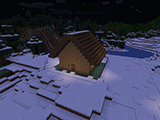
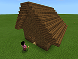

# Inosyan's MakeCode sources / イノシャンの MakeCode ソース

This is a library and article for 'Microsoft MakeCode for Minecraft' by inosyan. You can use it by importing URL to MakeCode.  
[Setting up MakeCode for Minecraft](https://minecraft.makecode.com/setup)  

これはイノシャンによる Microsoft MakeCode for Minecraft のために書かれたライブラリ、および作品です。 MakeCodeにインポートして利用することができます。  
[MakeCode で Minecraft のプログラミングをしてみました](http://inosyan.hateblo.jp/entry/2018/09/20/005901)  
[MakeCodeとマインクラフトでプログラミングを始めるための環境構築](http://inosyan.hateblo.jp/entry/2018/09/22/180011)  

## Library / ライブラリ
### inosyan_core_math
Update date 更新日 2018.09.30  
MakeCode URL: https://makecode.com/_E81LKU3Kz5LY  
[[Source]](src/inosyan/core/math/)  
This is a part of inosyan's library. It contains codes related to mathematics.  
これはイノシャンのライブラリの一部です。計算に関するコードを含んでいます。  

----
### inosyan_core_utils
Update date 更新日 2018.10.01  
MakeCode URL: https://makecode.com/_XgyEDa9PfXws  
[[Source]](src/inosyan/core/utils/)  
This is a part of inosyan's library. It contains codes to be used general purpose.  
これはイノシャンのライブラリの一部です。汎用的に使うコードを含んでいます。  

----
### inosyan_core_creator
Update date 更新日 2018.10.01
MakeCode URL: https://makecode.com/_4pkVE81phhqH  
[[Source]](src/inosyan/core/creator/)  
This is a part of inosyan's library. It contains codes related to architecture.  
これはイノシャンのライブラリの一部です。建築に関するコードを含んでいます。  

## Work / 作品
### House Builder
Update date 更新日 2018.10.02  
Project name / プロジェクト名: inosyan_housebuilder  
MakeCode URL: https://makecode.com/_PygTt2CRd4fm  
[[Source]](src/inosyan/app/housebuilder/)  [[Youtube]](https://youtu.be/MyUZA6bOkoo)  
This is the work titled "House Builder" created by inosyan.
It contains programs to build houses and to clear blocks in a wide area.  
これはイノシャンの作品「ハウスビルダー」です。
家を建てるプログラムと、広範囲のブロックを消すプログラムを含んでいます。

----
### Movie Camera
Update date 更新日 2018.10.06  
Project name / プロジェクト名: inosyan_moviecamera  
MakeCode URL: https://makecode.com/_9bm9yUDHb8bo  
[[Source]](src/inosyan/app/moviecamera/)  
  
This is the work titled "Movie Camera" created by inosyan.  
It controls camera programmatically for movie capturing.  
これはイノシャンの作品「ムービーカメラ」です。  
動画撮影に便利なカメラの動きをプログラムで制御します。

----
### Block Cleaner
Update date 更新日 2018.10.08  
Project name / プロジェクト名: inosyan_blockcleaner  
MakeCode URL: https://makecode.com/_HmtTtrbxhUeL  
[[Source]](src/inosyan/app/blockcleaner/)  
  
This is the work titled "Block Cleaner" created by inosyan.  
It contains programs to clear blocks in a wide area.  
これはイノシャンの作品「ブロッククリーナー」です。  
広範囲のブロックを消すプログラムを含んでいます。  
